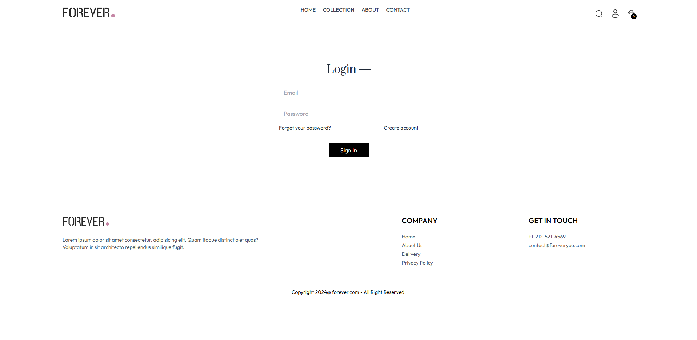
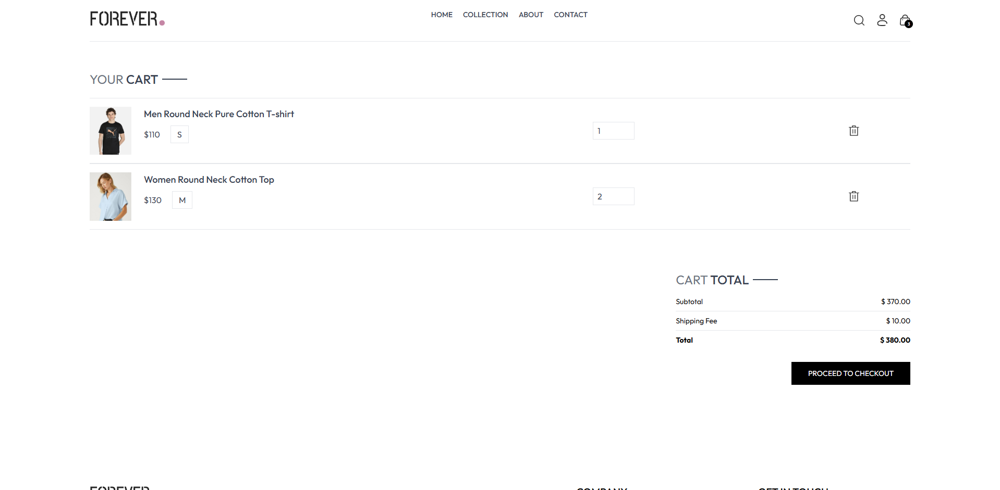
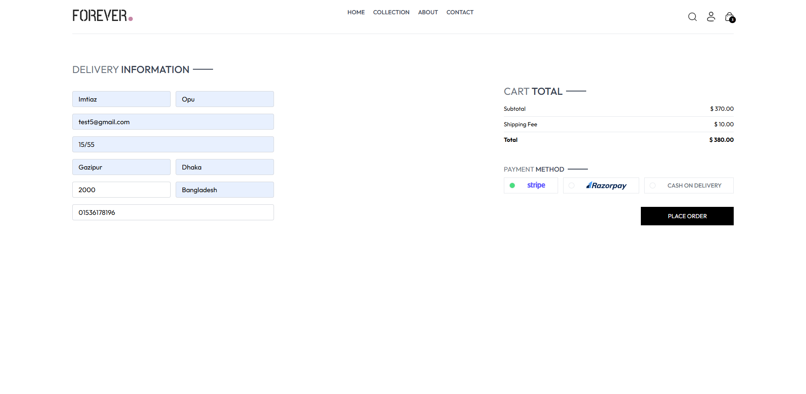
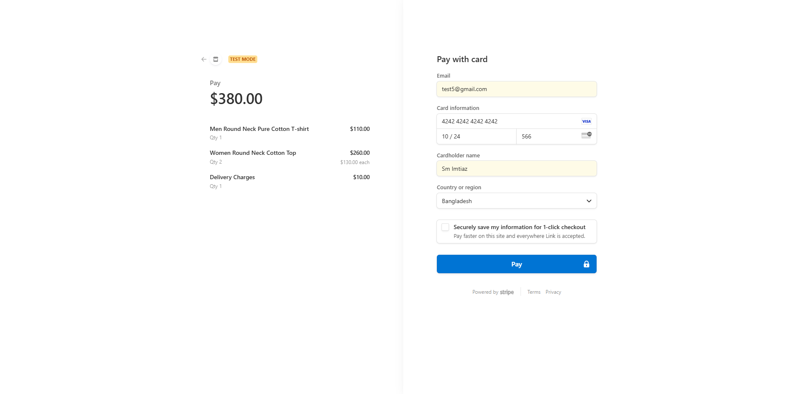
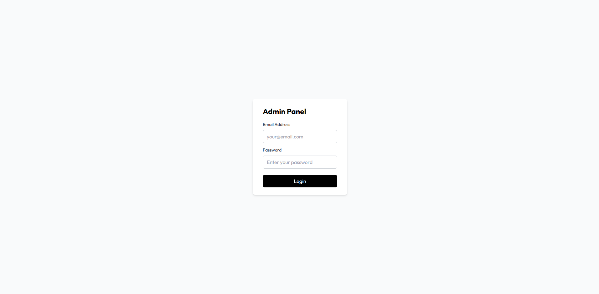
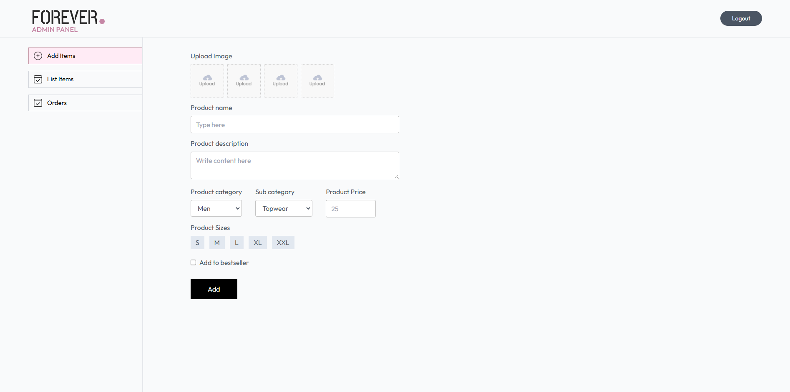
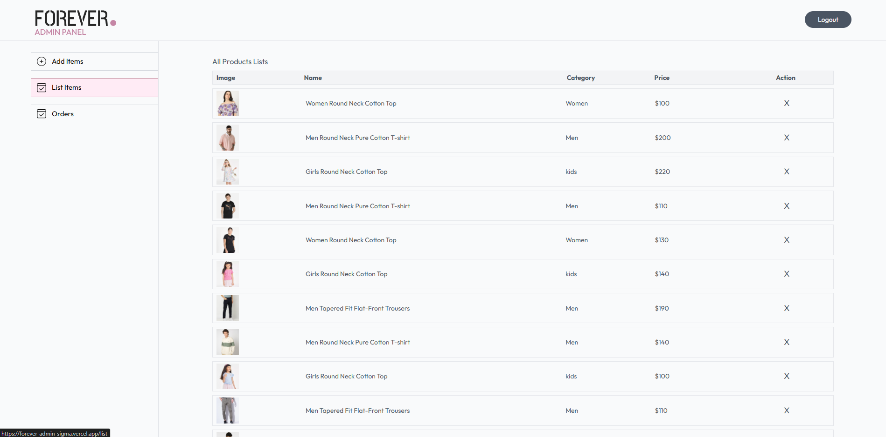
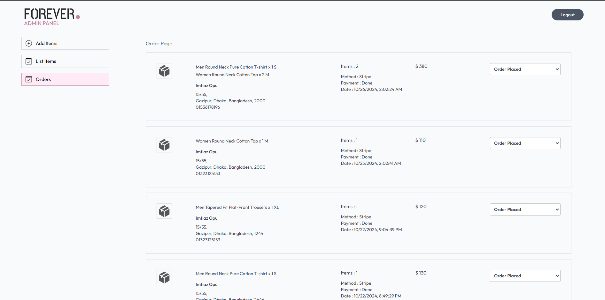

1. Install dependencies for the frontend:

```
   cd frontend
   npm install
```

2. Install dependencies for the backend:

  ```
   cd backend
   npm install
  ```

3. Add a `.env` file for environment variables in the frontend, admin and backend directory, including the following:

Frontend & admin
```
VITE_BACKEND_URL =<Your Backend URL>
```

Backend

```
   MONGODB_URI=<Your MongoDB URI>
   JWT_SECRET=<Your JWT Secret>
   CLOUDINARY_API_KEY  = <Your Cloudinary API Key>
   CLOUDINARY_SECRET_KEY = <Your Cloudinary Secret key>
   CLOUDINARY_NAME = <Your Cloudinary Name>
   ADMIN_EMAIL = <Your MongoDB URI>
   ADMIN_PASSWORD = <Your Admin password>
   STRIPE_SECRET_KEY = <Your Stripe Secret>
```


4. Run both frontend and backend:
```
npm run dev
```

Screenshots
FRONTEND










Admin Dashboard





